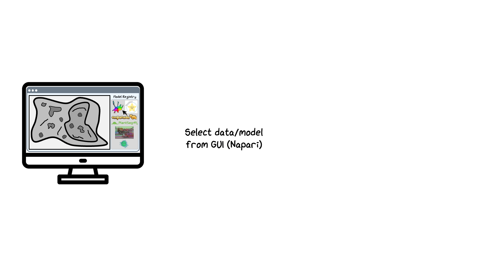
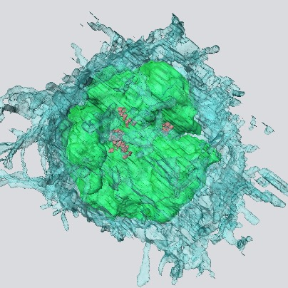

# AI OnDemand (AIoD)

## Overview
AI OnDemand (AIoD) is a framework developed by the [Software Engineering & AI STP](https://www.crick.ac.uk/research/platforms-and-facilities/software-engineering-and-artificial-intelligence) at the [Francis Crick Institute](https://www.crick.ac.uk/) that enables running any model on any compute environment without requiring user knowledge on how to install and run these models, let alone run them at scale on HPC/cloud compute (via [Nextflow](https://www.nextflow.io/docs/latest/index.html))!

AIoD allows you to easily run any of our [available models](#available-models) on your data efficiently using whatever compute you have (from a laptop to HPC or cloud!) with minimal setup!

=== "Microscopist"

    AIoD provides a Napari interface that allows you to select your data, preprocessing options, which model you want (with any parameters you want to tweak), and then run it with no need to install any of the individual models. You can run this on your local workstation or on HPC with no additional setup!

    If you do not have AIoD setup on your institute's HPC and would like to use it, please send [this documentation](./sections/getting_started/index.md#hpc-non-crick) to your HPC admins. If you just want to try it out on your machine first, see our [Getting Started](./sections/getting_started/index.md#getting-started) page!

=== "Image Analyst"

    AIoD provides an easy way to quickly run a range of different models on data, without the pain of installation (particularly on HPC). This allows you to quickly use models, tune their parameters, and get results!

    With our future finetuning release, you'll also easily be able to finetune all models included in AIoD!

=== "Model Developer"

    After you have developed and published your model, you want people to use it! Typically, it's difficult to provide guidance to all potential users how to install and use your model, especially if they want to run it on their local HPC or cloud compute.

    AIoD provides a central platform to simplify running models on any compute. You can add your model to AIoD without much work (details [here](./sections/contributing/expanding.md#add-a-new-model-family)), and it will immediately become available to all! Note that if you want to share your model in a more limited way, then you can define model location by a filepath so only those that have access can use it. 

=== "Research Software Engineer"

    AIoD provides a Nextflow pipeline as the computational backend, separating it from the user interface. At present we have a Napari plugin, but plugins for other software like ImageJ/QuPath can be easily added to make it easier for your users.

    If you already have your own pipelines, then you can look at our [Nextflow pipeline](./sections/nextflow/index.md) and use the components most relevant for you. Our work on parallelising models over data should be useful no matter what!

=== "HPC Admin"

    AIoD uses Nextflow for its computational pipeline, enabling it be deployed it virtually any compute environment. See our [Getting Started](./sections/getting_started/index.md#hpc-non-crick) page for requirements and setup details.

    If you are able to run some kind of virtual desktop/visual server (we use Open OnDemand), then our [Napari plugin](./sections/front_ends/napari_plugin/index.md) provides a visual interface that simplifies usage for your users.

It is designed to allow the use of arbitrary user interfaces (currently with a fully-fledged [Napari plugin](./sections/front_ends/napari_plugin/index.md)) to simplify usage and immediately visualise results while separating compute from visualisation.

Here's a simplified GIF outlining AIoD:

!!! note "Cricksters"

    **Users within the Francis Crick Institute have automatic access to AIoD with no setup required.**
    
    If users outside of the Crick want to use AIoD on their HPC and are not HPC admins/specialists, please forward [this page](./sections/getting_started/index.md) to your HPC admins. Alternatively, see our [AIoD-Napari over SSH](./sections/front_ends/napari_plugin/inference.md#execution-over-ssh) or [Nextflow directly](./sections/nextflow/index.md#running-the-pipeline-directly) sections to use AIoD on your HPC without the need for OnDemand/virtual desktop. 

## Available Models
Although AIoD is a portable, efficient, expandable framework to run any model, for users the practical functionality is determined by which models are available! 

Currently, the following models are integrated: 

  <a href="https://github.com/MouseLand/cellpose" class="model-card">
    
    Cellpose
  </a>
  <a href="https://github.com/stardist/stardist" class="model-card">
    
    StarDist
  </a>
  <a href="https://github.com/facebookresearch/sam2" class="model-card">
    Segment Anything (1+2)
  </a>
  <a href="https://github.com/stardist/stardist" class="model-card">
    
    Empanada
  </a>
  <a href="https://github.com/stardist/stardist" class="model-card">
    
    PlantSeg
  </a>
  <a href="https://github.com/FrancisCrickInstitute/em-segment-pytorch/" class="model-card">
    
    Etch-a-Cell Models
  </a>

...with more on the way (and [by request](./sections/support/index.md#contact-us))!

## Contribution

AIoD is developed as an extendable platform, allowing users to easily add new models, preprocessing functions etc., that can become available to all or restricted users as desired. This simplifies and unifies running models on local, high-performance, or cloud compute!

If you want to use a model that is not currently available, see [how to add a model](./sections/contributing/expanding.md) or get in [contact with us](./sections/support/index.md#contact-us). 

## Repositories

- [:simple-github: __Segment-Flow__](https://github.com/FrancisCrickInstitute/Segment-Flow) — Nextflow pipeline that scalably, reproducibly distributes data over models
- [:simple-github: __Model Registry__](https://github.com/FrancisCrickInstitute/AIoD-Model-Registry) — Pydantic schema and model manifests for each model in AIoD
- [:simple-github: __AIoD Utils__](https://github.com/FrancisCrickInstitute/aiod_utils) — Centralized I/O, custom RLE mask encoding, preprocessing functions...anything needed across front-ends and the Nextflow pipeline!
- [:simple-github: __Napari Plugin__](https://github.com/FrancisCrickInstitute/ai-on-demand) — Our plugin for Napari to make using the pipeline easier, with [additional functionality for users](./sections/front_ends/napari_plugin/index.md)!
- [:simple-github: __AIoD Documentation__](https://github.com/FrancisCrickInstitute/aiod_docs) — This documentation!

