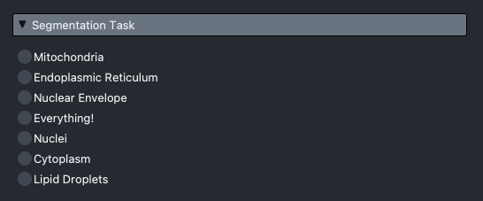
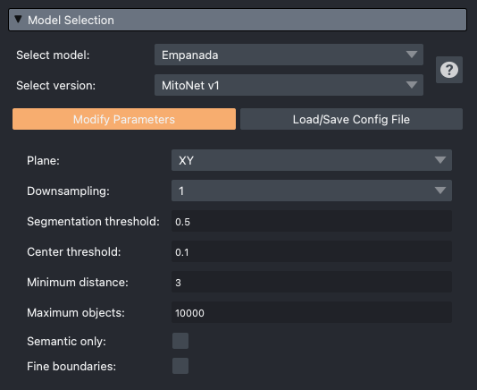
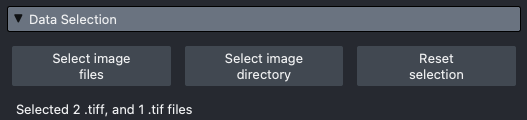
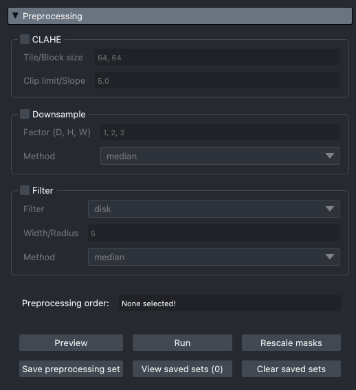
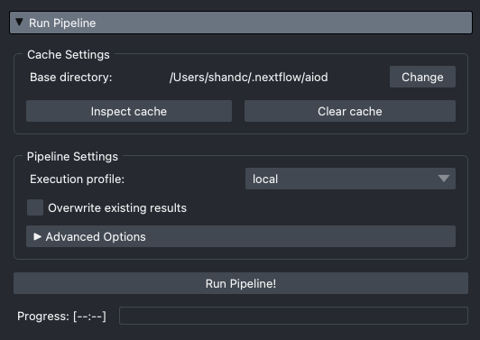
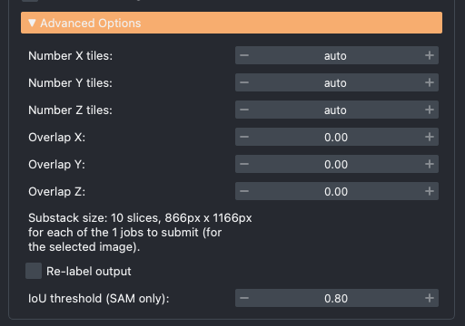
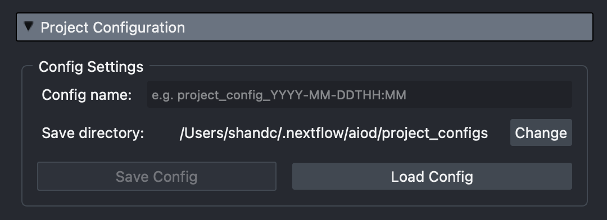

# Inference Widget

## Plugin Overview/Usage
This section gives a brief overview of the main components of the plugin. The dropdown boxes of the plugin are typically run in order top-to-bottom!

### Task Selection
Select the relevant task to filter available [models to select](#model-selection).

{width=75%}

### Model Selection
The [top-level model family](../../concepts/index.md#model-family) will be filtered depending on the selected [task](#task-selection). This also filters which [model version](../../concepts/index.md#model-version) you can choose. Also, you can only see models that are *accessible* to you. *Accessible* models are those in our registry defined by a URL, or by a filepath that you have access to (further details [here](../../concepts/index.md#model-location)).

Clicking "Modify Parameters" will open all the available parameters to edit for the chosen model. For some models, the performance is highly-dependent on correct settings of these parameters. Each parameter has a tooltip that explains what it is, but it is recommended checking the official documentation of that model for further guidance. To view all parameters and tooltips, as well as any links to that model's documentation, click the :octicons-question-16: (model info) icon.

{width=75%}

### Data Selection
You can drag+drop into Napari as normal, or use these buttons to load specific files or whole directories of images. You can also remove all data through the "Reset selection" button.

{width=75%}

As shown, the number of loaded files (organised by extension) will be shown to make it clear what will be sent to the [Nextflow pipeline](../../nextflow/index.md).

### Preprocessing
To enable each preprocessing function, click the :octicons-checkbox-16: checkbox. The order of the preprocessing functions is shown at the bottom, and is determined by the order in which the functions are clicked.

{width=75%}

You can:

- `Preview` the preprocessing, which will run the functions on one slice of your currently selected image (layer) to give a visual output
- `Run` the preprocessing on the entire selected image (helpful for when using 3D functions)
- `Rescale masks`, which will rescale any output masks from the pipeline that have been downsampled for better visualisation
- `Save preprocessing set` to create a set of preprocessing functions based on the current selection. This will be stored and sent to the pipeline
- `View saved sets` to view the currently saved sets (with a number to indicate the amount of saved sets)
- `Clear saved sets` to remove any stored sets

The pipeline will run on *every saved set*!

### Pipeline Setup
Before running the pipeline, make sure your cache shows a location where you have some space. Advice on selecting a cache location can be found here, but in short try to place it as centrally as possible if you are part of a group. Note that the location will be remembered between sessions.

You then have options to open the cache and selectively delete different parts, if you have run a lot of experiments and can remove old results.

For the execution profile, you should select the profile that matches where you are running AIoD:

- If you are running on your local computer/workstation, use `local`
- If you are at the Crick and using NEMO, use `crick`
- Otherwise, use your relevant institutional profile. If none exists, see [our guidance on adding one](../../contributing/expanding.md#add-a-profile).

{width=75%}

After clicking the "Run Pipeline!" button, the progress bar will update as each substack is completed to give an indication of progress and expected finish time!

??? tip "Advanced Options"

    This dropdown allows you to adjust how the images are split. As the default biases towards a cuboid shape, for some models+data (particularly 2D models) you may prefer to create substacks with a larger XY and smaller Z.

    As discussed [here](../../nextflow/index.md#individual-level), users do not have complete control over the shapes to avoid overloading available hardware. The substack size number of jobs that will be submitted with the current settings is shown at the bottom.

    {width=75%}

### Project Config

For ease of use (especially when switching between projects), you can save and load a project config. This will store and load and every single UI selection across the plugin, making it quick to e.g. re-select model parameters and preprocessing sets.

{width=75%}

### Mask Export

You can export all masks, or if you have a `Labels` layer selected just export that one. The dropdown shows the file formats support to export to, allowing you to then use the masks elsewhere.

The `.rle` format is the most compact, but cannot be read without the use of `aiod_utils`. For use with other programs, we recommend to export as a `.tiff`.

!!! warning "Export for Permanency!"

    All masks by default live in the [AIoD cache](../../concepts/index.md#caching), which should be periodically cleared. Therefore, once happy with results we recommend you export them to a more permanent location!

## Configuration
The Napari plugin has a few key variables that you need to be aware of. The rest of the UI should be self-explanatory, but please see our [video tutorial](./index.md#tutorials) above for a fuller usage guide if you prefer.

### Base/Cache Directory

As discussed in our [AIoD Concepts](../../concepts/index.md#caching) section, the cache is where models, config files, and all outputs (i.e. segmentation mask files) exist.

Where you select to place this cache has a few considerations, namely:
- If you have any space limits (common with home directories on HPC systems), select a directory you have access to with more space
- If you want to have a cache at a lab or institute level, select a central location where everyone has write access. This allows for more [reloading previous results](../../concepts/index.md#reloading-results), and reduces the collective storage footprint of downloaded models (at the potential cost of privacy — see note below)

The path/directory you select will be remembered in future sessions.

!!! note

    As discussed in our [development roadmap](../../development/index.md), future extension to a finetuning pipeline will therefore provide the ability to generate finetuned models, which will be stored in this cache. Therefore, if you are concerned about privacy for proprietary data or unpublished work, ensure that the cache location is somewhere local to your lab (or other group granularity) as needed.

### Execution Profile

This is the execution profile that will be used by our [Nextflow pipeline](../../nextflow/index.md), and it governs how and (effectively) where the pipeline is run. It is important that you select the right profile depending on where you want to run the pipeline.

=== "Local"

    You can run the pipeline locally (i.e. on your laptop/workstation) using the `local` profile.

    Note that this is not recommended when working with larger data, unless you are using a workstation with appropriate resources (i.e. a GPU, and enough RAM for the data you are using). For a bit of guidance on setting up the profile, see [this section](../../contributing/expanding.md#add-a-profile).

=== "Crick HPC (NEMO)"

    Please select the `crick` profile. Note that this is true whether you are running it via the AIoD OnDemand app, or to NEMO [over SSH](#execution-over-ssh).

=== "Non-Crick HPC"

    You will need to setup a profile that works for your given HPC, so long as it is one of [Nextflow's executors](https://www.nextflow.io/docs/latest/executor.html). I recommend using the [Crick profile](https://github.com/FrancisCrickInstitute/Segment-Flow/blob/master/profiles/crick.conf) as a template, and adapt it to your needs. Further guidance can be found [here](../../contributing/expanding.md#add-a-profile).

    See the [contributing a profile](../../contributing/expanding.md#add-a-profile) section for guidance on how to make this accessible to other users at your institution.

=== "Cloud"

    You will need to setup a profile that works for your given cloud platform, so long as it is one of [Nextflow's executors](https://www.nextflow.io/docs/latest/executor.html).

    See the [contributing a profile](../../contributing/expanding.md#add-a-profile) section for guidance on how to make this accessible to other users, if you want.

## Project Configuration
To better facilitate working across different projects, or to generally speed up working with the plugin, you can save and load "project config" files. These files capture *every single element of the plugin*, so that all options, parameters, data etc. currently selected can be recreated from this file.

Note that, as discussed [here](../../concepts/index.md#project_configs), these files are stored in the central cache by default.

!!! tip

    Saving and loading config files will not only help with reproducibility and sharing AIoD usage across teams, but will greatly speed up testing different models and working on different projects with different analysis needs.

## Execution over SSH

!!! warning

    This is a more advanced feature that requires you to have SSH keys setup with access to your HPC (or to wherever the computation is taking place, e.g. a workstation).

It is possible with our Napari plugin to remotely execute the Nextflow pipeline, allowing you to e.g. run Napari locally, while running the segmentation distributed on your HPC, and receiving the results locally to view. Note that running the Nextflow pipeline directly may be simpler, however, and is discussed [here](../../nextflow/index.md#running-the-pipeline-directly).

To do this, you will need:

1. SSH keys setup for your given remote computation (workstation, HPC etc.) — note that you need to know *which* key can access that compute as you will need to select it for use
2. Your remote data mounted/accessible by your local computer
3. A place where the head Nextflow job can run (i.e. not a login node, where that is appropriate!)

To enable this feature, you will need to enter the required information in the SSH options box:

<!-- FIGURE OF SSH OPTIONS -->

The parameters are as follows:

- _"Hostname"_: Name of where you are SSH'ing into (i.e. `ssh username@<HOSTNAME>`)
- _"Target node"_: For HPC systems where there is a login node before any compute nodes, enter the name of the actual target compute node here.
    - If you would normally proxyjump, the hostname is what you jump *through*, and this is what you jump *into*
- _"Username"_: The username you use to SSH (i.e. `ssh <USERNAME>@hostname`)
- _"Passphrase"_: Any passphrase associated with your SSH key
- _"Remote path prefix"_: The prefix of the path on the remote machine to the directory you have mounted (e.g. `/hpc/lab/my_lab/my_big_data`)
- _"Mounted path prefix"_: The prefix of the path on your local machine to the remote mounted directory (e.g. `/Volumes/my_big_data`)
- _"Command prepend"_: Any commands that need to be executed before the `nextflow run ...` command. This is useful for any module loading, or any other setup required

!!! example "Examples"

    === "Generic"

        1. Ensure you have a SSH connection to where `nextflow run` will be sent to. Note: in an HPC environment, you may first need to create an interactive session for this to run on.
        2. Locally, mount the remote destination so that you can see/access the relevant data.
            - If you were to mount the data on your HPC institution on a Mac, the mounted drive would be under `/Volumes/`. Let's say, `/Volumes/my_big_data`. This is your _"Mounted path prefix"_. On the HPC itself, the actual path to that folder is then your _"Remote path prefix"_, e.g. `/hpc/lab/my_lab/my_big_data`.
        3. Configure SSH settings:
            - _"Hostname"_: The remote hostname (either exact IP address, or the alias you have setup in your SSH config)
            - _"Target node"_: The hostname of whatever interactive session you have, if applicable
            - _"Username"_: Your username on the remote machine
            - _"Passphrase"_: Whatever passphrase is associated with your SSH key
            - _"Remote path prefix"_: The remote path start, e.g. `/hpc/lab/my_lab/`
            - _"Mounted path prefix"_: `/Volumes/` (for Mac; for Windows use the appropriate letter where you have mounted the drive)
            - _"Command prepend"_: Anything that you need to do on the remote system to enable Nextflow (if not by default, e.g. `ml Nextflow`)
            - Then select the SSH key you have authenticated for NEMO

    === "Crick"

        4. Create an interactive session, which you can do via an OnDemand session or an `nint` session.
        5. Ensure that you have NEMO mounted locally. Change your ["Base directory"](#basecache-directory) to an appropriate location in the mounted drive (i.e. somewhere on NEMO with space, or wherever your current AIoD cache is).
        6. Configure the SSH settings:
            - _"Hostname"_: `login.nemo.thecrick.org`
            - _"Target node"_: The node assigned in step 1, e.g. `cn093`
            - _"Username"_: Your NEMO username
            - _"Passphrase"_: Whatever passphrase is associated with your SSH key
            - _"Remote path prefix"_: `/nemo/lab` (or stp or project as needed)
            - _"Mounted path prefix"_: `/Volumes/` (for Mac; for Windows use the appropriate letter where you have mounted the drive)
            - _"Command prepend"_: `ml Nextflow/24.04.1`
            - Then select the SSH key you have authenticated for NEMO
        7. Run the pipeline as normal!