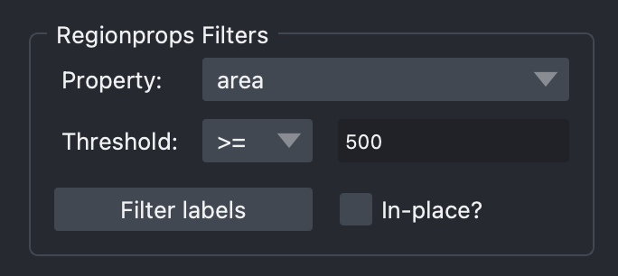
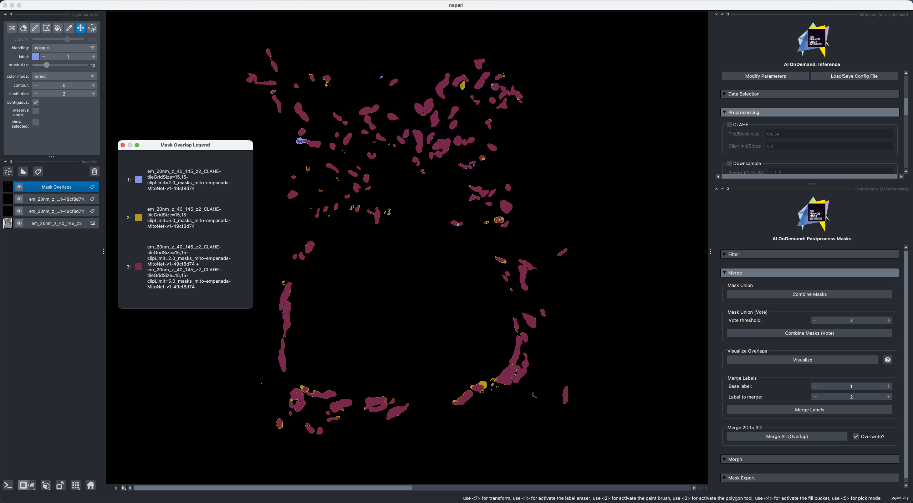

# Postprocessing Widget

The postprocessing widget gives you various options for modifying segmentation masks. It is present just as a useful utility as requested by users, but it's functionality is purely contained within the Napari plugin and does not form apart of the wider AIoD framework. Many of these functions are inspired by the [`empanada-napari` proofreading tools](https://empanada.readthedocs.io/en/latest/index.html).

!!! note

    **These functions are run locally wherever Napari is running**. This is not a Nextflow pipeline, no jobs are submitted. Most functions are fairly lightweight so this should not be a problem!

The following sections will provide a quick explanation for each function.

!!! tip "In-place or not?"

    Many of the postprocessing functions have a checkbox to determine whether the function operates in-place or not. When checked, the selected layer will be updated directly. If not checked, a new layer will be created with the results from the function. This can be useful when testing different function to avoid changing your original masks.

## Filter
### Filter Label
This removes a single label from the output.

!!! tip "Automatic update"

    If you use the eyedropper tool in the `Labels` layer controls, the value to filter will automatically update, making it easier to remove specific labels.

### Regionprops Filters
Filter all labels based on properties available from [`scikit-image`'s `regionprops`](https://scikit-image.org/docs/stable/api/skimage.measure.html#skimage.measure.regionprops).

Users can provide a value, and determine how to filter with this value using the threshold drop-down. Note that the threshold sign identifies what is *kept*.

!!! example

    {width=75%}

    Here, **we will keep any regions that have an area of 500 or more pixels**.

## Merge
Many of these functions operate on binarized masks. The [morph](#morph) sections provides utilities to switch between binary and instance labels, if needed.

### Mask Union
This function simply creates a binary union between the selected layers, merging them.

### Mask Union (Vote)
This function allows for a parameterized union, where the value represents the number of layers that must have a non-zero label present to result in a non-zero value.

### Visualize Overlaps
This function operates on any number of selected `Labels` layers (though more than 5 are not recommended due to reasonable limits on colour perception).

It will create a new layer that has a unique colour for every combination of masks across the layers, easily highlighting where outputs differ. This is useful when comparing different preprocessing or model parameters, clearly showing different areas of the image/object/ROI that are segmented differently. The :octicons-question-16: icon button will pop-out a window that shows all the labels/colours generated, and their name (showing which layers contributed to that).

!!! example

    {width=100%}

    In this example, we have compared the outputs of MitoNet with 2 different parameter settings for CLAHE, highlighting where the preprocessing values are helping the model to capture different parts of cells!

### Merge 2D to 3D
This function takes in a single `Labels` layer, and merges the label IDs of any objects that connect over the Z-axis. This is effectively a 3D connected components function, aligning objects over Z, which is useful for a 2D segmentation model.

## Morph

### Morphological Operations
This enables running four morphological operations: dilation, erosion, opening, and closing. These can be useful for adjusting segmentation masks to correct for model deficiencies without retraining or other more expensive adjustments. The structuring element (or how the kernel is defined) can be controlled by selecting the shape (2D square and disk, 3D cube and ball) and it's size. You can find further details and guidance on each of the operations and the inputs [here](https://scikit-image.org/docs/stable/auto_examples/applications/plot_morphology.html).

### Fill Holes
This uses [`skimage.morphology.remove_small_holes`](https://scikit-image.org/docs/stable/api/skimage.morphology.html#skimage.morphology.remove_small_holes) to remove holes within an object smaller than the specified size.

### Binarize Masks
This function will binarize all masks, so only background (0) and foreground (masks; 1) will exist.

!!! warning

    It is recommended that you do not execute this in-place. For outputs where separate instances are touching once binarized the original result can be difficult to recover without reloading the source data.

### Label Masks
This functions runs connected components to assign unique labels/IDs to the masks.

If the checkbox to "Label across skipped slices" is checked, then a 1-slice dilation will be performed across the Z-axis, allowing for a consistent labelling across frames for an object that may not align for a single slice. This can be useful with 2D models where data with artefacts could cause a disruption in segmentation.

## Export Masks

The same as [inference widget](./inference.md#mask-export), select the data and format to export your postprocessed masks!