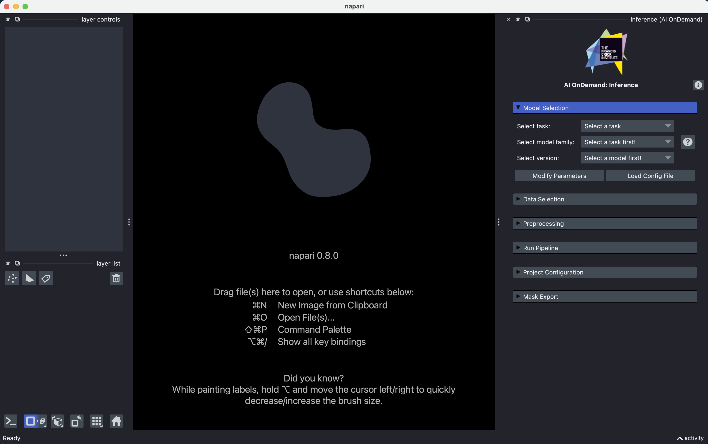
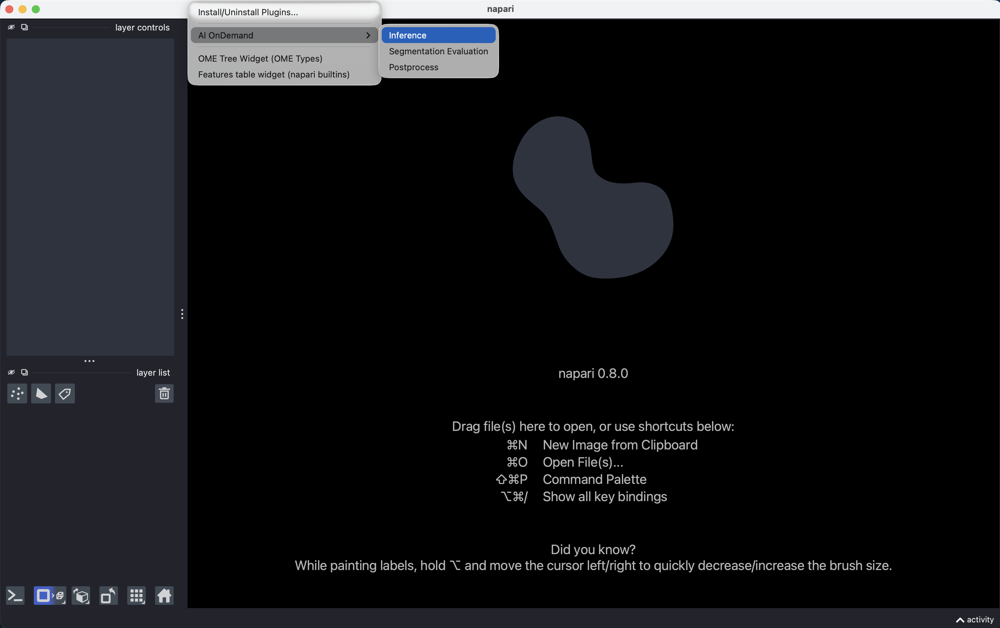
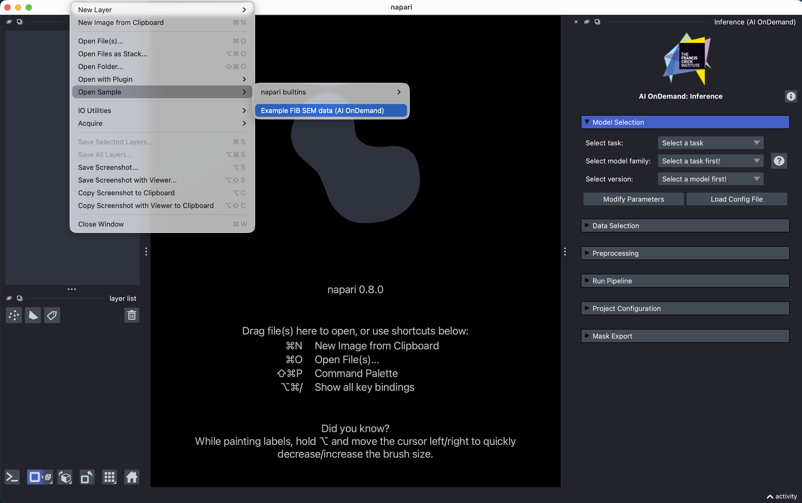
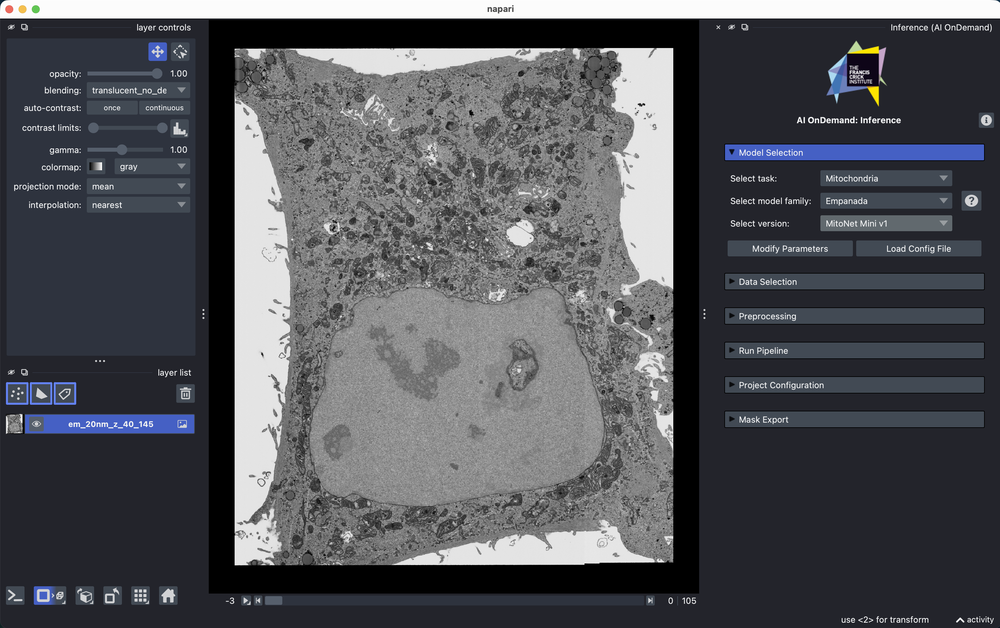
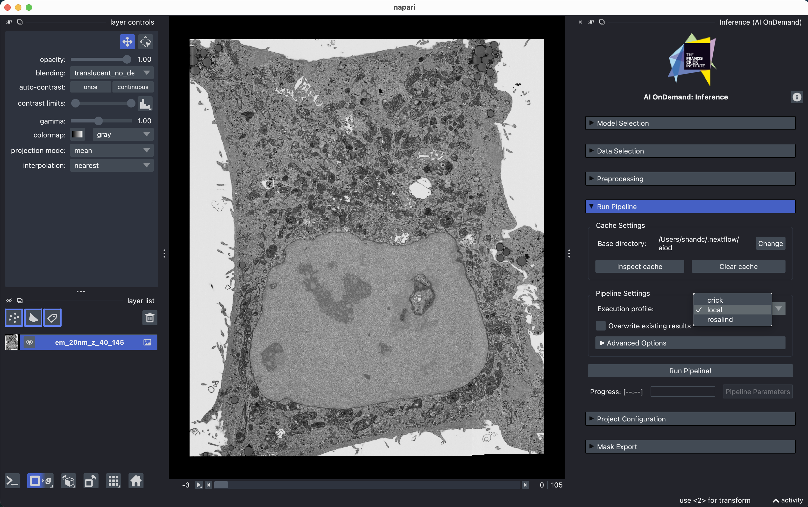
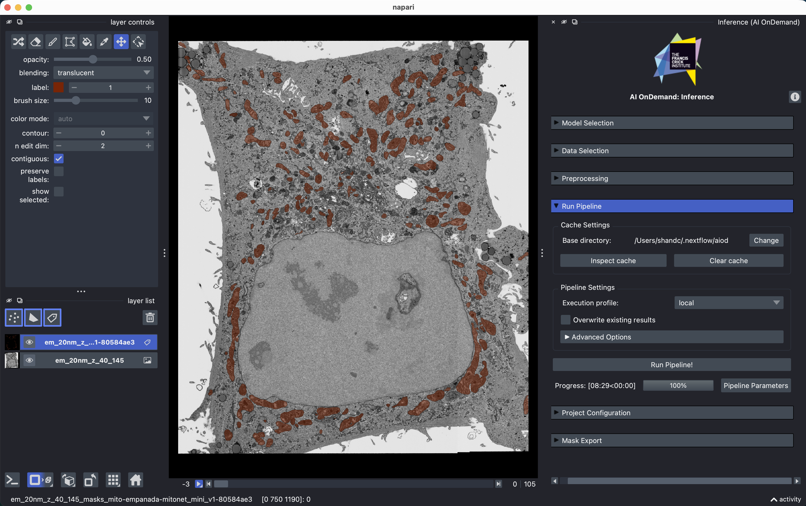
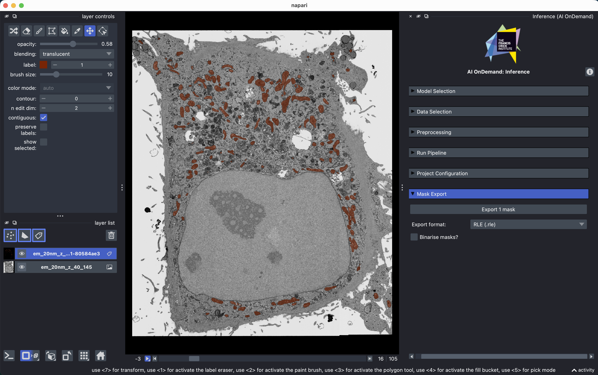

# Your First Segmentation (Napari)

This tutorial takes you from nothing installed to a set of segmentation masks you can open in other software. It uses a small example image that AIoD downloads for you, so you don't need to bring your own data yet.

**You will:**

1. Install Napari and the AIoD plugin
2. Load our built-in example electron microscopy image
3. Segment its mitochondria with a pre-trained model
4. Save the results

**You need:**

- A computer with an internet connection
- About 15 minutes (first run takes longer; a GPU makes this faster but is not required)

!!! tip "In a hurry?"

    If you are comfortable with a terminal and Napari, this is the whole tutorial:

    1. `uv venv aiod-env && source aiod-env/bin/activate && uv pip install "napari[all]" aiod_napari`
    2. Install [Nextflow](https://www.nextflow.io/docs/latest/install.html) and [Conda](https://www.anaconda.com/docs/getting-started/miniconda/install)
    3. `napari -w aiod-napari Inference`
    4. **File :material-arrow-right: Open Sample :material-arrow-right: AI OnDemand :material-arrow-right: Example FIB SEM data**
    5. Task **Mitochondria** :material-arrow-right: model **Empanada** :material-arrow-right: version **MitoNet Mini v1**
    6. Set a cache directory with a few GB free, profile `local`, then **Run Pipeline!**
    7. **Export masks** :material-arrow-right: **Output format: TIFF** :material-arrow-right: **Export all masks**

## 1. Install AIoD
!!! success "At the Crick?"

    Skip this step. Open the **AI on Demand (AIoD)** app on NEMO OnDemand and everything is installed for you. Continue from [step 3](#3-load-the-example-image), opening the plugin from the **Plugins** menu, and use the `crick` profile instead of `local` in [step 5](#5-configuring-your-cache-and-the-pipeline).

Installation is done from a terminal (also called the command line). Open one now:

- **macOS:** open the **Terminal** app. You can find it by pressing <kbd>Cmd</kbd>+<kbd>Space</kbd> and typing "Terminal".
- **Linux:** open your distribution's terminal application.
- **Windows:** Nextflow does not run on Windows directly, so you first need the [Windows Subsystem for Linux (WSL)](https://learn.microsoft.com/en-us/windows/wsl/install). Once it is installed, open the **Ubuntu** app from the Start menu and do everything below inside it.

Type (or paste) each command in the grey boxes below into the terminal, then press <kbd>Enter</kbd> to run it.

### 1.1 Nextflow and Conda

These two tools run the models behind the scenes. Install [Nextflow](https://www.nextflow.io/docs/latest/install.html) and [Conda](https://www.anaconda.com/docs/getting-started/miniconda/install) by following their own instructions. You never install the models themselves; AIoD will handle that for you.

**Check it worked:** run `nextflow -version` and then `conda --version`. Each should print a version number.
{: .check }

### 1.2 Napari and the AIoD plugin

Install Napari and the plugin into a Python *environment*: a self-contained folder of Python packages that keeps AIoD separate from anything else on your computer. We use [`uv`](https://docs.astral.sh/uv/getting-started/installation/) for this, so install that if you don't have it. Then run these three commands, which:

1. Create an environment called `aiod-env` in the folder your terminal is currently in
2. Activate that environment
3. Install Napari and our plugin into it

```bash
uv venv aiod-env
source aiod-env/bin/activate
uv pip install "napari[all]" aiod_napari
```

??? tip "Prefer conda, venv, or pixi?"

    Any environment manager is fine. See the [full installation options](../front_ends/napari_plugin/index.md#installation), including installing the plugin from within Napari itself. The only requirement is that `nextflow` is available on the command line *in the same environment where Napari runs*, because the plugin calls it directly.

## 2. Start Napari with the AIoD plugin

In the same terminal, start Napari with the AIoD plugin (and "Inference" widget) already open:

```bash
napari -w aiod-napari Inference
```

The first launch can take a minute. Leave the terminal open while you use Napari, as closing it closes Napari too.

The AIoD panel appears on the right-hand side, made up of collapsible sections, with the first open. In general, you work through the sections from top to bottom, though this tutorial doesn't need all of them.

**Check it worked:** you should see this:
{: .check }

{width=100%}

??? tip "Opening the plugin from the menu"

    If Napari is already running (for example on NEMO OnDemand), open the panel from **Plugins :material-arrow-right: AI OnDemand :material-arrow-right: Inference**:

    {width=100%}

    The same menu also offers `Postprocess` and `Segmentation Evaluation`. Those work on masks you already have, so you won't need them for a first run. Come back to them [later](#where-next).

??? tip "Starting Napari again later"

    Next time, open a terminal, go to the folder where you created `aiod-env` (e.g. `cd ~` if you created it in your home folder), and run:

    ```bash
    source aiod-env/bin/activate
    napari -w aiod-napari Inference
    ```

    If you skip the `source` line, Napari either won't start or won't find the AIoD plugin.

## 3. Load the example image

Start with our bundled image: **File :material-arrow-right: Open Sample :material-arrow-right: AI OnDemand :material-arrow-right: Example FIB SEM data**.

{width=100%}

The first time you do this, AIoD downloads the image (a few tens of MB), so it may take a moment. It is a 3D FIB-SEM volume of cells. As this is a stack of 2D slices, a slider appears along the bottom of the canvas. Drag it to scroll through the volume and get a feel for the data.

**Check it worked:** you should see a greyscale image in the canvas, a layer named `em_20nm_z_40_145` in the layer list on the left, and a slider under the canvas.
{: .check }

<figure markdown>
  <video class="docs-clip" controls muted loop playsinline preload="metadata"
         poster="../../../assets/clips/example_data_slide.png"
         aria-label="Clip: scrolling through the Z-axis of the example data">
    <source src="../../../assets/clips/example_data_slide.mp4" type="video/mp4">
  </video>
  <figcaption>Scrolling through the Z-axis of the example data using the slider.</figcaption>
</figure>

??? tip "Using your own data instead"

    You can drag and drop files into Napari as usual, or use the buttons in the plugin's **Data Selection** section to load a single file or an entire directory at once. The plugin shows a count of the loaded files grouped by extension, so you can confirm what will be sent off for segmentation. More detail in the [Data Selection reference](../front_ends/napari_plugin/inference.md#data-selection).

## 4. Choose what to segment, and with what

**First, pick the task.** The task is simply *what you want to find in the image*, and choosing it filters the model list down to models that can do it. For this tutorial, select **Mitochondria**.

**Second, pick the model.** In the model section, choose **Empanada** as the model, and **MitoNet Mini v1** as the version:

*Empanada* is a family of related models; *MitoNet Mini v1* is one specific model within it. We are using the "Mini" version because it is the smallest and therefore the quickest to download and run. As a general rule-of-thumb, smaller models will be faster to run but may not perform as well.

!!! tip "Use default parameters"

    You will see a **Modify Parameters** button. Ignore it for now. Model quality can depend heavily on these settings, but the defaults are sensible and changing things before you have seen a baseline result makes it very hard to tell what helped.

    When you do come back to them, every parameter has a tooltip explaining it, and the :octicons-question-16: button on the right of model selection links to that model's own documentation.

    The same goes for the **Preprocessing** section. It can make a big difference ([later](#where-next)), but leave it alone for now.

**Check it worked:** the task shows *Mitochondria*, the model shows *Empanada*, and the version shows *MitoNet Mini v1*:
{: .check }



## 5. Configuring your cache and the pipeline

Our **Run Pipeline** box is where everything actually happens, but requires two important things to be set: the cache location and the Nextflow execution profile.

**Cache directory.** This is where AIoD stores downloaded models, configurations, and all your results. Set it to a location with a few GB free. On a laptop, the default is fine. On a shared or managed machine, avoid your home directory if it has a small quota. Your choice is remembered between sessions, so you only need to set this once, or when you want to change it.

**Execution profile.** This tells AIoD what kind of machine it is running on, so it knows how to use its resources. Choose `local` for a laptop or workstation. If you are using AIoD through NEMO OnDemand at the Crick, choose `crick` instead. The profile has to match where Napari is running; choosing `crick` on your laptop will not send the work to NEMO.

??? info "Why the location of the cache directory is important"

    The cache should be considered semi-permanent rather than scratch space: keeping results around is what lets AIoD skip work it has already done, and lets you reload previous runs instantly. If you are part of a lab or group, putting the cache somewhere everyone can write files to means you all share downloaded models and each other's results, which can avoid wasted compute.

    The trade-offs (including privacy considerations for unpublished data) are covered in [Caching](../concepts/index.md#caching).

Here's mine, running locally on a Mac, for reference:


## 6. Run it

Click **Run Pipeline!**

!!! warning "The first run may be slow. This is normal!"

    Before it can segment anything, AIoD has to build a Conda environment for Empanada and download the model weights. Depending on your machine, this may take a few minutes.

    Every subsequent run using this model skips both steps and starts almost immediately.

Once the segmentation itself starts, the progress bar advances as each chunk of the image is finished, which also gives you a rough estimate of the remaining time. Under the hood AIoD has split the volume into pieces and is working through them in parallel to make best use of your hardware (see [Segmenting at Scale](../concepts/index.md#segmenting-at-scale) if you're curious).

!!! tip "Intermediate results"

    As each of the chunks is finished, that partial result will be filled on Napari. This can be particularly useful to see intermediate results, allowing you to cancel the pipeline early if things aren't looking up-to-scratch.

**Check it worked:** when the run finishes, a "Pipeline finished!" pop-up box will show in the bottom-right of the viewer, and we'll have our masks as shown below.
{: .check }



## 7. Look at your results

When we clicked *Run Pipeline!*, a [`Labels` layer](https://napari.org/stable/howtos/layers/labels.html) was created. We've only provided one dataset, but for future reference one layer is created per dataset (i.e. per [`Image` layer](https://napari.org/stable/howtos/layers/image.html)).

By default, we have a *semantic* segmentation (with a single class, in this case mitochondria), not an *instance* segmentation. If you want each object to have its own ID/colour, there are two ways to get this:

1. *Before* a run, set the output type. **Run Pipeline** :material-arrow-right: **Advanced Options** :material-arrow-right: Set **Output mask type** to *instance*; or
2. *After* a run, open the separate [**`Postprocessing` widget**](../front_ends/napari_plugin/postprocess.md#label-masks) :material-arrow-right: **Morph** :material-arrow-right: **Label masks**

A few things worth doing to better inspect the results:

- Click the layer's :octicons-eye-16: icon to toggle the masks on and off. Flicking back and forth against the raw image is the quickest way to judge whether a result is any good.
- Drag the **opacity** slider in the layer controls to see the image through the masks.
- Scroll through the Z slider again. The masks should follow the structures through the volume.

If you are unfamiliar with Napari, this clip illustrates those actions:
<figure markdown>
  <video class="docs-clip" controls muted loop playsinline preload="metadata"
         poster="../../../assets/clips/inspect_masks.png"
         aria-label="Toggling the mask layer's visibility, lowering its opacity, and scrolling through the Z stack to focus on objects.">
    <source src="../../../assets/clips/inspect_masks.mp4" type="video/mp4">
  </video>
</figure>


**The result may not be perfect.** No model is right everywhere, and improving it is what parameters, preprocessing, and other models (potentially in combination) are for. See [the last section](#where-next) for how to take this forward on your own data.

## 8. Save your masks

Open the bottom **Mask Export** section, choose a format, and export.



Use **`.tiff`** if you want to open the masks in Fiji, QuPath, or anything else. The default **`.rle`** option produces much smaller files, but note that only AIoD's own tools can read them.

With no layer selected, everything is exported; select a single `Labels` layer to export just that one.

!!! warning "Export anything you want to keep"

    Your results currently live only in the AIoD cache that you set in [step 5](#5-configuring-your-cache-and-the-pipeline), which is meant to be cleared periodically. Once you are happy with a result, export it somewhere permanent.

**You're done.** You have installed AIoD, run a pre-trained deep learning model on a 3D image, and saved the output.


## Something went wrong?

??? failure "Napari can't find `aiod-napari`, or it isn't in the Plugins menu"

    Napari is probably not running in the environment where you installed the plugin. Activate the environment (`source aiod-env/bin/activate`), then launch Napari from that same terminal with `napari -w aiod-napari Inference`.

??? failure "The run fails immediately, mentioning `nextflow`"

    The plugin runs `nextflow` as a command, so it must be on your `PATH` in the environment Napari was started from. Check with `nextflow -version` in the terminal you launched Napari from. If that fails, revisit [step 1](#1-install-aiod).

??? failure "It fails while setting up the environment for the model"

    This is `conda` creating the model's environment, and it needs both network access and disk space. Check that you have several GB free wherever your cache directory points, and that you can reach the internet. Then try the run again. AIoD will pick up where it left off rather than starting over.
    
    If that fails again, then conda may have created a partial environment. You will need to delete the offending environment(s), which can be found in the cache location we set in [step 5](#5-configuring-your-cache-and-the-pipeline), e.g. `/Users/<USERNAME>/.nextflow/aiod/conda`.

??? failure "The model I want isn't in the list"

    Two likely reasons. First, the model list is filtered by the selected task, so check the task is right for that model.
    
    Second, some models are shared by file path rather than public download, and are only visible to people with access to that location (see [Model Location](../concepts/index.md#model-location)). For public pre-trained models like Empanada, Cellpose, StarDist etc., they will always be available.

If none of these solve your problem, [get in touch or raise an issue](../support/index.md), including what you selected and any error message.

## Where next

Now that you have a first result, you can start adapting AIoD to your own data:

<div class="grid cards" markdown>

- :material-tune: **Improve the result**: adjust model parameters, or try a different model on the same task. The [Inference reference](../front_ends/napari_plugin/inference.md) covers every control in the widget.
- :material-image-filter-center-focus: **Preprocess your images**: contrast adjustment and rescaling often matter more than the choice of model. See [Preprocessing](../front_ends/napari_plugin/inference.md#preprocessing).
- :material-eraser: **Clean up masks**: filter objects by size, merge 2D masks into 3D, or compare two results visually with the [Postprocess widget](../front_ends/napari_plugin/postprocess.md).
- :material-chart-box: **Measure agreement**: compare masks against a ground truth or against each other with the [Evaluation widget](../front_ends/napari_plugin/evaluation.md).
- :material-server: **Scale up**: skip the GUI and run the pipeline straight from the terminal, on your own machine or your institution's HPC, with [Your First Segmentation (Command Line)](./first_headless_run.md).
- :material-content-save-cog: **Work reproducibly**: save every setting in the panel to a [project config](../front_ends/napari_plugin/inference.md#project-configuration) to reload or share later.

</div>
