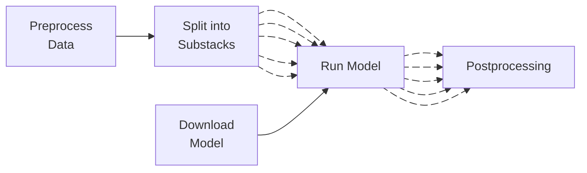

# Nextflow Pipeline (`Segment-Flow`)

Our [Nextflow pipeline](https://github.com/FrancisCrickInstitute/Segment-Flow) is where the actual code and processes for running models, and orchestrating the parallelization happens.

## Pipeline Structure

The pipeline is roughly structured as:



The sections below will briefly outline each section, and any considerations for input parameters.

### Preprocess Data
This step will run any specified preprocess functions (from the [available functions in our utils package](https://github.com/FrancisCrickInstitute/aiod_utils/blob/main/aiod_utils/preprocess.py)) across each of the input images.

!!! note "Temporary Copy"

    At present, this will create a copy of the data within the [cache](../concepts/index.md#caching). For large input data, it is recommend to [periodically clear the cache](../concepts/index.md#clearing-the-cache) to avoid issues.

For each _set_ of preprocessing parameters, the pipeline will be run over that version of the data. This can quickly generate a lot of jobs, but can be incredibly useful when e.g. using multiple parameters of CLAHE to differentially improve performance in different regions, creating a superior composite result. See the [examples below](#preprocessing-examples) for how to structure the input for one or more sets.

### Split into Substacks
This step will split the input image(s) into a series of substacks/subvolumes, which will be parallelized over. This is of course most effective in HPC environments, but it also flexibly enables running models in constrained environments in a similar way to mapping a function over blocks of a Dask array.

The `overlap` argument will control (in each of the 3 spatial dimensions) how much overlap there is between each substack, which can be useful for models that perform better on non-boundary objects.

!!! under-construction "Auto-scaling to Hardware"

    In a future release, this splitting step will dynamically adjust substack size to the hardware that you have available, and calculate the best size to maximize resource utilization given the input data and model selected.


### Download Model
The model will be downloaded (if a URL) or copied into the cache (if a filepath) for use by the pipeline.


### Run Model
The specified model will run (in it's own environment) on each of the substacks. Depending on the [executor/profile](#command-explained), this will be done **as parallel as possible** on the given system.

If run via the Napari plugin, as each individual job finishes intermediate results will be loaded in, allowing for quick inspection and potentially early exit to adjust parameters.

### Postprocessing
Each of the parallelised-substacks needs to be stitched back together to create the final result. This process ensures a consistent labelling to the masks across substacks through a simple connected components.

If `overlap>0` for any dimension, then the postprocessing will combine overlapping masks.

!!! under-construction "Parameterized Voting"

    In a future release, there will be various input parameters to allow for customization in the voting mechanism for this combination.

If `iou_threshold>0`, then masks will only be labelled the same over Z-slices if they overlap with the specified minimum [IoU](https://en.wikipedia.org/wiki/Jaccard_index). At present, this is only applied to the Segment Anything models (1 & 2) due to their high density of mask output and conflicting information. *Note that this can be computationally intensive due to the large number of masks that SAM can produce!*


## Running the Pipeline Directly
The Nextflow pipeline can be run directly, allowing headless use and avoiding Napari or any other front-end. Although more work is required in specifying the input parameters, 

An example run command may look like:

```
nextflow -log /Users/shandc/.nextflow/aiod/nextflow.log run FrancisCrickInstitute/Segment-Flow -latest -w /Users/shandc/.nextflow/aiod/work -profile local -params-file /Users/shandc/.nextflow/aiod/aiod_cache/nxf_params_43e45ccf52a1503556b86df6e8b47959.yml
```

Where the [params-file](https://www.nextflow.io/docs/latest/cli.html#pipeline-parameters) looks like:

```yaml title="Example 'params-file' (nxf_params_43e45ccf52a1503556b86df6e8b47959.yml)"
img_dir: /Users/shandc/.nextflow/aiod/aiod_cache/all_img_paths.csv
iou_threshold: 0.8
model: empanada
model_chkpt_fname: MitoNet_v1.pth
model_chkpt_loc: https://zenodo.org/record/6861565/files/MitoNet_v1.pth?download=1
model_chkpt_type: url
model_config: /Users/shandc/.nextflow/aiod/configs/mito-empanada-MitoNet-v1_config_e92afea9536c4ab53e377fb8c6ffe01c.yaml
model_type: MitoNet-v1
num_substacks: auto,auto,auto
overlap: 0.0,0.0,0.0
param_hash: 43e45ccf52a1503556b86df6e8b47959
postprocess: false
preprocess: null
root_dir: /Users/shandc/.nextflow/aiod
task: mito
```

!!! info "What's wrong with your filenames?"

    In the example above, the files were generated automatically by the Napari plugin to maximize [reproducibility](../concepts/index.md#reproducibility-hashing).

    For running the pipeline directly, we recommended using some clear, traceable naming system, whether that's using datetime or some other format.

#### Command Explained
Brief explanation of the arguments used in the command above:

- `-log`: Path for the log file
- `-latest`: Pulls the latest version of the [repo](https://github.com/FrancisCrickInstitute/Segment-Flow) before running
- `-profile`: Which [profile](https://www.nextflow.io/docs/latest/config.html#config-profiles) to use
- `-w`: Path for the `workDir` (i.e. intermediate outputs)
- `-params-file`: Path the parameter file (example above, explained [below](#parameters-explained))

For other arguments, see the [Nextflow documentation](https://www.nextflow.io/docs/stable/cli.html).

#### Parameters Explained

!!! under-construction "To be improved!"

    This will be simplified in an upcoming release!

- `img_dir`: Path to the CSV that defines the input image data (details [below](#creating-the-input-csv))
- `iou_threshold`: Threshold for [IoU postprocessing](#postprocessing)
- `model`: Name of the [model family](../concepts/index.md#model-family) to use
- `model_chkpt_fname`: Filename of the model checkpoint to use
- `model_chkpt_loc`: Location of the model checkpoint to use (full system filepath or URL)
- `model_chkpt_type`: Whether the `model_chkpt_loc` is a "url" or "file"
- `model_config`: Path to a configuration file to path to the specified model
- `model_type`: The model version to use
- `num_substacks`: How many substacks to create when splitting (recommended to use the default: `auto,auto,auto`)
- `overlap`: Amount of overlap to use in substack creation (HWD / YXZ format)
- `param_hash`: Unique ID for reproducibility and identifying this run (see [here](../concepts/index.md#reproducibility-hashing) for details)
- `postprocess`: Whether to run connected components on the final, combined masks (`true`/`false`)
- `preprocess`: Preprocessing parameters to use (see [examples below](#preprocessing-examples))
- `root_dir`: Root [cache directory](../concepts/index.md#caching)

##### Preprocessing Examples
1. Single set of preprocessing parameters:
    ```yaml
    ...
    preprocess:
    - - name: CLAHE
        params:
          clipLimit: 5.0
          tileGridSize:
          - 15
          - 15
      - name: Downsample
        params:
          block_size:
          - 1
          - 2
          - 2
          method: median
    ...
    ```

2. Two sets of preprocessing parameters (the pipeline will be run twice for each set of preprocessing parameters)
    ```yaml
    ...
    preprocess:
    - - name: CLAHE
        params:
          clipLimit: 5.0
          tileGridSize:
          - 15
          - 15
      - name: Downsample
        params:
          block_size:
          - 1
          - 2
          - 2
          method: median
    - - name: Downsample
        params:
          block_size:
          - 1
          - 2
          - 2
          method: median
    ...
    ```

**Note that it's much easier when the Napari plugin generates this for you!**

### Creating the Input CSV
The input CSV file (e.g. `all_img_paths.csv` [above](#__codelineno-1-1)) provides a definitive source of truth for the dimensions of the input data, which can be useful in the cases of missing, incorrect or misunderstood metadata.

You can use [`aiod_utils.image_paths_to_csv`](https://github.com/FrancisCrickInstitute/aiod_utils/blob/55667739a882ac1c9c4e127d041ffb09370e5cd6/aiod_utils/io.py#L80) to more easily create this CSV, though it requires providing a `dict` specifying the size of each dimension. Missing dimensions will be guessed, so it is important to review the generated CSV afterwards!

The resulting CSV should look like:
```csv
img_path,num_slices,height,width,channels
<path>,5,1000,1000,3
...
```

!!! warning "Filepaths"

    The filepaths in this CSV are the paths for wherever the computation is actually taking place, so the paths need to make sense for where the pipeline is actually running.
    
    When working locally and sending the command to the HPC, the filepath(s) must be those on the HPC itself, not e.g. the mounted path. For more information, see our section on [executing over SSH](../front_ends/napari_plugin/inference.md#execution-over-ssh).


## Tuning the Pipeline

### Pipeline-/Institutional-Level
The [dynamic resource requests functionality of Nextflow](https://www.nextflow.io/docs/latest/process.html#dynamic-task-resources) allows us to be efficient in our requests on HPC (or other compute), such that we are not requesting far more e.g. memory than is needed.

This works well for memory requests, but requesting the required time is often very dependent on the hardware itself, and can be hard to estimate ahead of time. The [current `crick` Nextflow profile](https://github.com/FrancisCrickInstitute/Segment-Flow/blob/master/profiles/crick.conf) is a good starting point, but when making your own [institutional profile](../contributing/expanding.md#add-a-profile) then there will be an initial period of experimentation to adjust the base time requests to minimize over-requesting on your system. The [Nextflow resource usage reports](https://www.nextflow.io/docs/latest/reports.html#resource-usage) are a fantastic place to start!

### Individual-Level
Beyond tuning the processes, a user has a certain level of control over how to run the pipeline through how the [substacks](../concepts/index.md#parallelising-substacks-to-maximize-gpu-usage) are created (their size and number).

In the [parameters](#parameters-explained) section above, we can see that `num_substacks` and `overlap` are the two input parameters that control this. Adjusting these values will provide control over how the images are split and parallelized. For instance, with some models it may be preferable to increase the splitting over Z and reduce the amount of splitting in XY. This may require experimentation, but the default (`auto`) is a good starting point.

!!! warning "Limited Control"

    Although these parameters can be changed to control the splitting, it would be very easy to create values that (on larger data) would create substacks that simply cannot be loaded onto a GPU. As a result, the splitting process will try to get as close as possible to the user requested values, with an upper bound of what has been [determined is possible with your given GPU/hardware](../concepts/index.md#parallelising-substacks-to-maximize-gpu-usage).