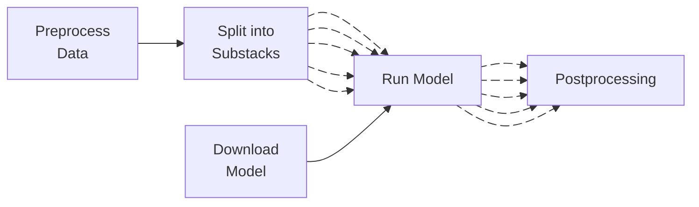

# Nextflow Pipeline ([`Segment-Flow`](https://github.com/FrancisCrickInstitute/Segment-Flow))

Our [Nextflow pipeline](https://github.com/FrancisCrickInstitute/Segment-Flow) is where the actual code and processes for running models, and orchestrating the parallelization happens.

## Pipeline Structure

The pipeline is roughly structured as:


```mermaid
flowchart LR
    A[Download<br>Model]
    B[Preprocess<br>Data]
    C[Split into<br>Substacks]
    D[Run Model]
    E[Postprocessing]

    B --> C
    C e1@--> D
    C e2@--> D
    C e3@--> D
    C e4@--> D
    C e5@--> D
    A --> D
    D e6@--> E
    D e7@--> E
    D e8@--> E
    D e9@--> E
    D e10@--> E
    e1@{ animation: fast }
    e2@{ animation: fast }
    e3@{ animation: fast }
    e4@{ animation: fast }
    e5@{ animation: fast }
    e6@{ animation: slow }
    e7@{ animation: slow }
    e8@{ animation: slow }
    e9@{ animation: slow }
    e10@{ animation: slow }
```

The sections below will briefly outline each section, and any considerations for input parameters.

### Preprocess Data
This step will run any specified preprocess functions (from the [available functions in our utils package](https://github.com/FrancisCrickInstitute/aiod_utils/blob/main/aiod_utils/preprocess.py)) across each of the input images.

!!! note "Temporary Copy"

    This writes a preprocessed copy of the data as OME-Zarr into Nextflow's [`work` directory](../concepts/index.md#work), one per set of preprocessing parameters. For large input data, it is recommended to periodically clear that directory to avoid issues.

For each _set_ of preprocessing parameters, the pipeline will be run over that version of the data. This can quickly generate a lot of jobs, but can be incredibly useful when e.g. using multiple parameters of CLAHE to differentially improve performance in different regions, creating a superior composite result. See the [examples below](#preprocessing-examples) for how to structure the input for one or more sets.

### Split into Substacks
This step will split the input image(s) into a series of substacks/subvolumes, which will be parallelized over. This is of course most effective in HPC environments, but it also flexibly enables running models in constrained environments in a similar way to mapping a function over blocks of a Dask array.

The `overlap` argument will control (in each of the 3 spatial dimensions) how much overlap there is between each substack, which can be useful for models that perform better on non-boundary objects.

!!! under-construction "Auto-scaling to Hardware"

    In a future release, this splitting step will dynamically adjust substack size to the hardware that you have available, and calculate the best size to maximize resource utilization given the input data and model selected.


### Download Model
The model will be downloaded (if a URL) or copied into the cache (if a filepath) for use by the pipeline.


### Run Model
The specified model will run (in it's own environment) on each of the substacks. Depending on the [executor/profile](#command-explained), this will be done **as parallel as possible** on the given system.

If run via the Napari plugin, as each individual job finishes intermediate results will be loaded in, allowing for quick inspection and potentially early exit to adjust parameters.

### Postprocessing
Each of the parallelised-substacks needs to be stitched back together to create the final result. This process ensures a consistent labelling to the masks across substacks through a simple connected components.

If `overlap>0` for any dimension, then the postprocessing will combine overlapping masks.

!!! under-construction "Parameterized Voting"

    In a future release, there will be various input parameters to allow for customization in the voting mechanism for this combination.

If `iou_threshold>0`, then masks will only be labelled the same over Z-slices if they overlap with the specified minimum [IoU](https://en.wikipedia.org/wiki/Jaccard_index). At present, this is only applied to the Segment Anything models (1 & 2) due to their high density of mask output and conflicting information. *Note that this can be computationally intensive due to the large number of masks that SAM can produce!*


## Running the Pipeline Directly

!!! tip "Looking for a walkthrough?"

    This section is the reference for every input the pipeline accepts. If you have not run it from the terminal before, [Your First Segmentation (Command Line)](../getting_started/first_headless_run.md) goes from nothing to masks step by step, and covers the parts with no GUI equivalent.

The Nextflow pipeline can be run directly, allowing headless use and avoiding Napari or any other front-end. Although more work is required in specifying the input parameters, this can be significantly faster for users who are happy with model performance and just want to segment a lot of data without wanting to keep Napari open!

An example run command may look like:

```bash
nextflow \
    -log /Users/shandc/.nextflow/aiod/nextflow.log \
    run FrancisCrickInstitute/Segment-Flow \
    -latest \
    -w /Users/shandc/.nextflow/aiod/work \
    -params-file /Users/shandc/.nextflow/aiod/aiod_cache/nxf_params_43e45ccf52a1503556b86df6e8b47959.yml \
    -profile local # (1)!
```

1.  Each argument is explained in [Command Explained](#command-explained) below.

Where the [params-file](https://www.nextflow.io/docs/latest/cli.html#pipeline-parameters) looks like:

```yaml title="Example 'params-file' (nxf_params_43e45ccf52a1503556b86df6e8b47959.yml)"
img_dir: /Users/shandc/.nextflow/aiod/aiod_cache/all_img_paths.csv
iou_threshold: 0.8
model: empanada
model_type: mitonet_v1
num_substacks: auto,auto,auto
output_format: rle
output_mask_type: auto
overlap: 0.0,0.0,0.0
param_hash: 43e45ccf52a1503556b86df6e8b47959
postprocess: false
preprocess: null
root_dir: /Users/shandc/.nextflow/aiod
task: mito
```

**Note many of these parameters have defaults and don't need to be included here! Only `img_dir`, `model`, `model_type`, and `task` are required!**

A complete list of parameters with some guidance can be obtained via:

```bash
nextflow run -latest FrancisCrickInstitute/Segment-Flow --help
```

!!! info "What's wrong with your filenames?"

    In the example above, the files were generated automatically by the Napari plugin to maximize [reproducibility](../concepts/index.md#reproducibility-hashing).

    For running the pipeline directly, we recommended using some clear, traceable naming system, whether that's using datetime or some other format. Setting `param_hash` yourself is how you do that — see [naming your runs](../getting_started/first_headless_run.md#naming-your-runs) for a worked example and the trade-off it carries.

#### Command Explained
Brief explanation of the arguments used in the execution/run command above:

- `-log`: Path for the log file
- `-latest`: Pulls the latest version of the [repo](https://github.com/FrancisCrickInstitute/Segment-Flow) before running
- `-profile`: Which [profile](https://www.nextflow.io/docs/latest/config.html#config-profiles) to use
- `-w`: Path for the `workDir` (i.e. intermediate outputs)
- `-params-file`: Path the parameter file (example above, explained [below](#parameters-explained))

For other arguments, see the [Nextflow documentation](https://www.nextflow.io/docs/stable/cli.html).

#### Parameters Explained

**Required:**

- `img_dir`: Path to the CSV that defines the input image data (details [below](#creating-the-input-csv))
- `model`: Name of the [model family](../concepts/index.md#model-family) to use (the `short_name` from its [registry manifest](../model_registry/index.md#schema))
- `model_type`: The [model version](../concepts/index.md#model-version) to use, given as its registry `slug`
- `task`: The [task](../concepts/index.md#task) the selected model version should perform

**Optional:**

- `iou_threshold`: Threshold for [IoU postprocessing](#postprocessing)
- `model_config`: Path to a configuration file of parameters for the specified model. Omit it to use the [default config generated from the registry](../model_registry/index.md#automatic-ingest)
- `num_substacks`: How many substacks to create when splitting (recommended to use the default: `auto,auto,auto`)
- `output_format`: Format to write the final masks in — `rle` or `tiff`
- `output_mask_type`: Whether masks are written as `binary`, `instance`, or `auto` to let the model's output decide
- `overlap`: Amount of overlap to use in substack creation (HWD / YXZ format)
- `param_hash`: Unique ID for reproducibility and identifying this run (see [here](../concepts/index.md#reproducibility-hashing) for details). Computed for you if omitted; set it to [name your runs](../getting_started/first_headless_run.md#naming-your-runs) something readable
- `postprocess`: Whether to run connected components on the final, combined masks (`true`/`false`)
- `preprocess`: Preprocessing parameters to use (see [examples below](#preprocessing-examples))
- `root_dir`: Root [cache directory](../concepts/index.md#caching)

**Advanced** — a few further parameters cap substack size, which most users will not need to set:

- `max_substack`: Global upper bound on substack size as `[H, W, D]`, applied to any model without a specific entry below
- `model_max_substack`: Per-model-family overrides of the above. An axis set to `null` is uncapped, deferring to the memory budget. Depth is the intended lever for controlling how long each job runs
- `substack_scale`: Single multiplier applied to *all* of the caps above, intended to be set once per deployment in the [execution profile](../contributing/expanding.md#add-a-profile) (e.g. `0.5` for a weaker GPU, giving smaller and therefore more numerous jobs)

These are combined with a memory-derived size calculated from the `memory_per_job` value in the [profile](../contributing/expanding.md#add-a-profile), with the smaller of the two winning on each axis.

##### Preprocessing Examples
1. Single set of preprocessing parameters:
    ```yaml
    ...
    preprocess:
    - - name: CLAHE
        params:
          clipLimit: 5.0
          tileGridSize:
          - 15
          - 15
      - name: Downsample
        params:
          block_size:
          - 1
          - 2
          - 2
          method: median
    ...
    ```

2. Two sets of preprocessing parameters (the pipeline will be run twice, once for each set of preprocessing parameters)
    ```yaml
    ...
    preprocess:
    - - name: CLAHE
        params:
          clipLimit: 5.0
          tileGridSize:
          - 15
          - 15
      - name: Downsample
        params:
          block_size:
          - 1
          - 2
          - 2
          method: median
    - - name: Downsample
        params:
          block_size:
          - 1
          - 2
          - 2
          method: median
    ...
    ```

3. An *empty* set (`- []`) means "no preprocessing", so the model is also run on your original data alongside the other sets. This is useful for comparing raw against preprocessed results in a single run, and no copy of your data is made for the empty set.
    ```yaml
    ...
    preprocess:
    - []
    - - name: CLAHE
        params:
          clipLimit: 5.0
          tileGridSize:
          - 15
          - 15
    ...
    ```

!!! tip "Which hash was which?"

    Each set of preprocessing parameters is identified by a hash, which appears in the output mask filenames. To save you decoding them, the pipeline logs a legend at the start of the run mapping each hash to the set it came from!

**Note that it's much easier when the Napari plugin generates this for you!**

### Creating the Input CSV
The input CSV file (e.g. `all_img_paths.csv` [above](#__codelineno-1-1)) provides a definitive source of truth for the dimensions of the input data, which can be useful in the cases of missing, incorrect or misunderstood metadata.

It has six columns, one row per image:
```csv
img_path,num_slices,height,width,channels,dtype
<path>,5,1000,1000,3,uint16
...
```

`num_slices`, `height`, `width` and `channels` are Z, Y, X and C respectively (use `1` for the dimensions your data does not have). Column *order* does not matter, but the names do. `dtype` is optional — it is read from the image if omitted.

For a walkthrough of writing this by hand, adapting an existing one, or generating it with [`aiod_utils.image_paths_to_csv`](https://github.com/FrancisCrickInstitute/aiod_utils/blob/v0.2.0/aiod_utils/io.py#L374-L441), see [step 3 of the command-line tutorial](../getting_started/first_headless_run.md#3-describe-your-images).

!!! warning "Dimensions are not inferred"

    Whichever route you take, the pipeline uses the values exactly as written. A wrong `channels` or `num_slices` is not caught when the run starts; it only shows up during the segmentation step, after the environment build and model download. Check the numbers before you run.

!!! warning "Filepaths"

    The filepaths in this CSV are the paths for wherever the computation is actually taking place, so the paths need to make sense for where the pipeline is actually running.
    
    When working locally but running the pipeline on HPC, the filepath(s) must be those on the HPC itself, not e.g. the mounted path. See [running it on HPC](../getting_started/first_headless_run.md#9-running-it-on-hpc) for the other things that change when the pipeline runs somewhere else.


## Tuning the Pipeline

### Pipeline-/Institutional-Level
The [dynamic resource requests functionality of Nextflow](https://www.nextflow.io/docs/latest/process.html#dynamic-task-resources) allows us to be efficient in our requests on HPC (or other compute), such that we are not requesting far more e.g. memory than is needed.

This works well for memory requests, but requesting the required time is often very dependent on the hardware itself, and can be hard to estimate ahead of time. The [current `crick` Nextflow profile](https://github.com/FrancisCrickInstitute/Segment-Flow/blob/master/profiles/crick.conf) is a good starting point, but when making your own [institutional profile](../contributing/expanding.md#add-a-profile) then there will be an initial period of experimentation to adjust the base time requests to minimize over-requesting on your system. The [Nextflow resource usage reports](https://www.nextflow.io/docs/latest/reports.html#resource-usage) are a fantastic place to start!

### Individual-Level
Beyond tuning the processes, a user has a certain level of control over how to run the pipeline through how the [substacks](../concepts/index.md#parallelising-substacks-to-maximize-gpu-usage) are created (their size and number).

In the [parameters](#parameters-explained) section above, we can see that `num_substacks` and `overlap` are the two input parameters that control this. Adjusting these values will provide control over how the images are split and parallelized. For instance, with some models it may be preferable to increase the splitting over Z and reduce the amount of splitting in XY. This may require experimentation, but the default (`auto`) is a good starting point.

!!! warning "Limited Control"

    Although these parameters can be changed to control the splitting, it would be very easy to create values that (on larger data) would create substacks that simply cannot be loaded onto a GPU. As a result, the splitting process will try to get as close as possible to the user requested values, with an upper bound of what has been [determined is possible with your given GPU/hardware](../concepts/index.md#parallelising-substacks-to-maximize-gpu-usage).